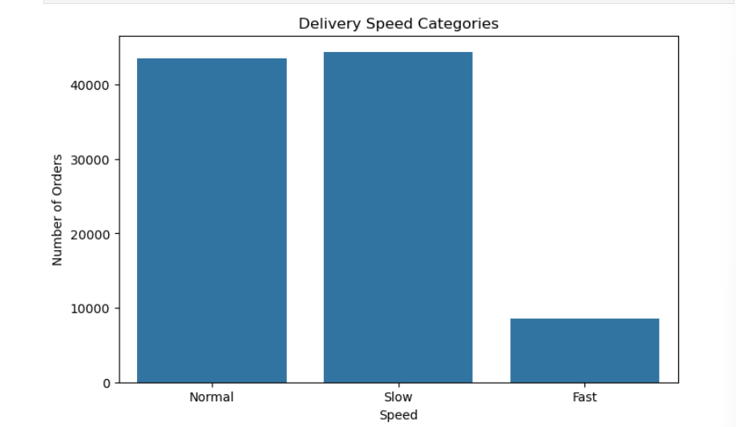
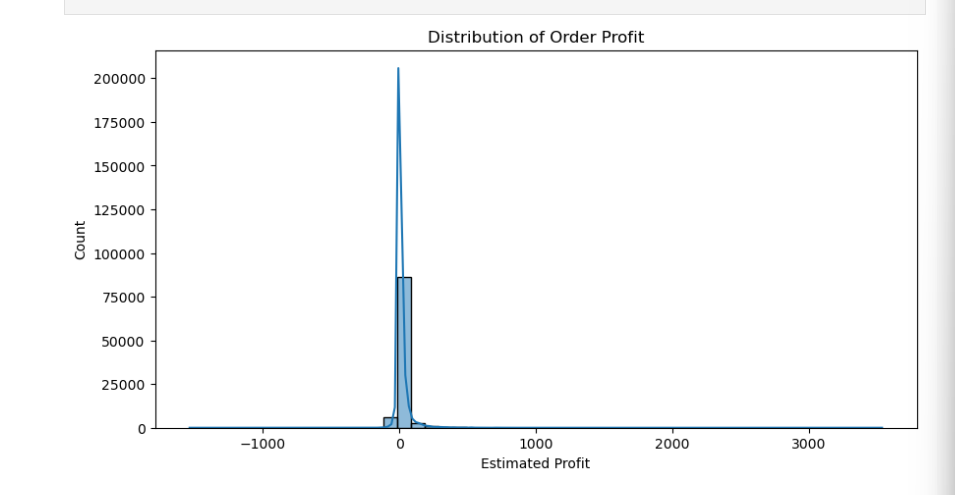
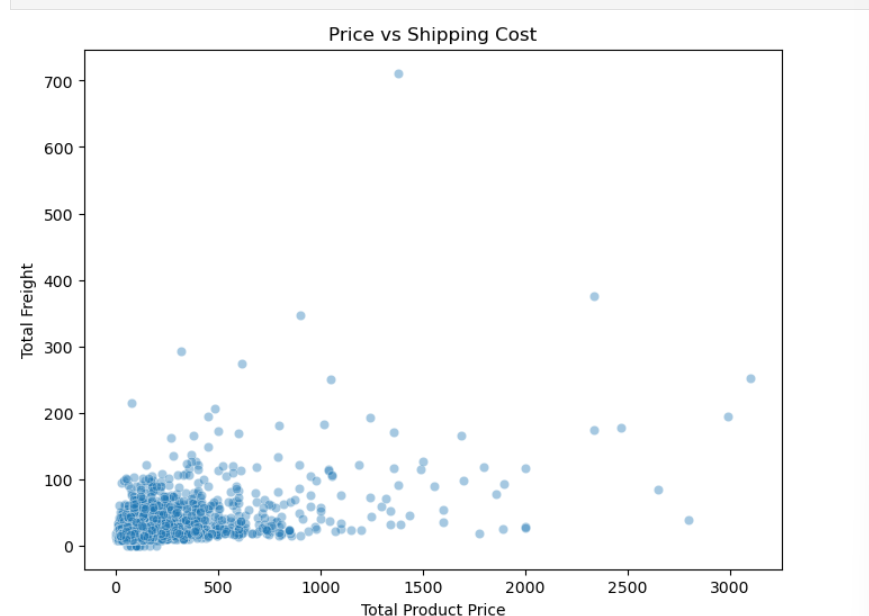

# ecommerce-cost-reduction-analysis
End-to-end e-commerce logistics cost analysis and 10% savings simulation in Python

This project analyzes shipping and operational patterns in a large Brazilian e-commerce dataset 
and builds a simulation model to estimate how much cost can be saved by optimizing high-cost orders.

### Key Highlights
- Cleaned and merged multiple Olist datasets (orders, items, payments, customers)
- Engineered shipping, revenue, and profit metrics
- Performed EDA on cost behavior, delays, and regional patterns
- Identified high-cost, low-value orders responsible for most cost leakage
- Built a simulation model achieving ~10% logistics cost savings

---

## 📊 Key Charts

### Before vs After Optimization

### Average Logistics Cost % by State

### Delivery Speed Categories

### Distribution of Order Profit

### Price vs Shipping

---

## 🔍 Summary

A small number of orders carry a large share of logistics cost, especially:
- low-value, single-item orders  
- orders shipped to remote states  
- orders with cost > product value  

By focusing on the highest-cost segment (top 20–30%) and applying a cost reduction  
of around 20–25%, the model shows that an overall **10% logistics cost reduction**  
is achievable.

---

## 🛠 Tools Used
- Python  
- Pandas  
- NumPy  
- Matplotlib  
- Seaborn  

---

## 📒 Notebook
The full notebook is available in the `data/` folder.

